# Open5GS Testbed - 5G Core Network

## Anggota Kelompok

1. ANANDA FIFADLIKA (235150207111045)
2. GAUNG TAQWA INDRASWARA (235150207111043)
3. MUHAMMAD FAUZAN (235150201111044)
4. AHMADHANI ATHAILLAH (235150207111069)

---

## Prasyarat

### Hardware Requirements

**Minimum:**

- 2 CPU cores
- 4 GB RAM
- 20 GB storage

**Recommended:**

- 4+ CPU cores
- 8+ GB RAM
- 50+ GB storage

### Software Requirements

**Linux Distribution:**

- Ubuntu 22.04 LTS atau 24.04 LTS, WSL
- Kernel 5.4+

**Packages yang akan di-install:**

- K3s (Kubernetes)
- Docker/Containerd
- kubectl
- git
- curl
- Wireshark (untuk packet analysis)

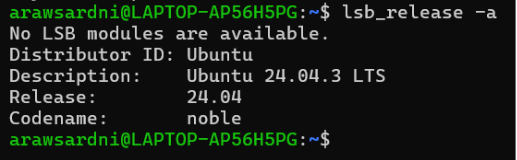

### Pengetahuan Prasyarat

- Linux command line basics
- Networking fundamentals (IP, DNS, TCP/UDP)
- Docker concepts (containers, images)
- YAML syntax
- Basic understanding of REST APIs

### Akses Sistem

```bash
# Pastikan punya sudo access
sudo whoami
# Should output "root"

# Clone repository
git clone https://github.com/rayhanegar/Open5GS-Testbed.git
cd Open5GS-Testbed
```

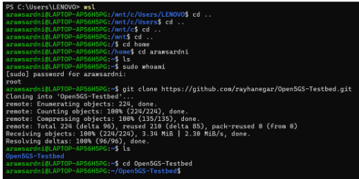

---

## Arsitektur Sistem

### Diagram Arsitektur Keseluruhan

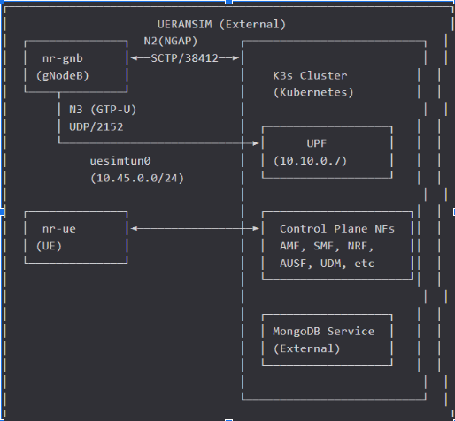

### Komponen K3s yang Di-Deploy

| Komponen StatefulSet | IP Statis   | Port        | Fungsi             |
| -------------------- | ----------- | ----------- | ------------------ |
| NRF (nrf-0)          | 10.10.0.10  | 7777        | Service Discovery  |
| SCP (scp-0)          | 10.10.0.200 | 7777        | Routing            |
| AMF (amf-0)          | 10.10.0.5   | 7777, 38412 | UE Registration    |
| SMF (smf-0)          | 10.10.0.4   | 7777        | Session Management |
| UPF (upf-0)          | 10.10.0.7   | 2152        | User Plane         |
| UDM (udm-0)          | 10.10.0.12  | 7777        | Subscriber Data    |
| UDR (udr-0)          | 10.10.0.20  | 7777        | Data Repository    |
| AUSF (ausf-0)        | 10.10.0.11  | 7777        | Authentication     |
| PCF (pcf-0)          | 10.10.0.13  | 7777        | Policy Control     |
| NSSF (nssf-0)        | 10.10.0.14  | 7777        | Slice Selection    |

### Network Slice Configuration

| Slice | SST | DNN          | Subnet       | Gateway   |
| ----- | --- | ------------ | ------------ | --------- |
| eMBB  | 1   | embb.testbed | 10.45.0.0/24 | 10.45.0.1 |
| URLLC | 2   | urllc.v2x    | 10.45.1.0/24 | 10.45.1.1 |
| mMTC  | 3   | mmtc.testbed | 10.45.2.0/24 | 10.45.2.1 |

---

## Instalasi dan Setup

### Step 1: Persiapan Sistem

```bash
# Update system
sudo apt-get update
```

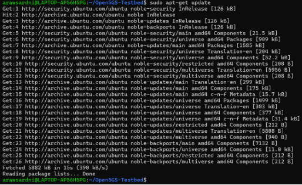

```bash
sudo apt-get upgrade -y
```

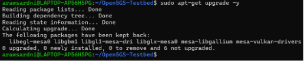

```bash
# Install dependencies
sudo apt-get install -y \
  curl \
  git \
  iptables \
  iptables-persistent \
  net-tools \
  iputils-ping \
  traceroute \
  tcpdump \
  wireshark \
  wireshark-common
```

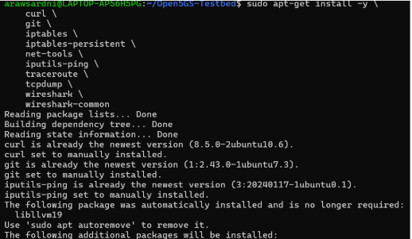

```bash
# Create log directories
sudo mkdir -p /mnt/data/open5gs-logs
sudo chmod 777 /mnt/data/open5gs-logs
```

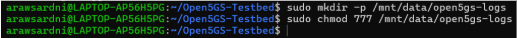

Clone this repo on your server: https://github.com/rayhanegar/Open5GS-Testbed

### Step 2: Setup K3s Environment dengan Calico

Navigate ke direktori K3s dan jalankan setup script:

```bash
cd ~/Open5GS-Testbed/open5gs/open5gs-k3s-calico

# Make script executable
chmod +x setup-k3s-environment-calico.sh

# Run setup
sudo ./setup-k3s-environment-calico.sh
```

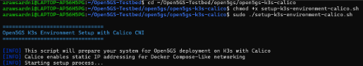

Script akan melakukan:

- ✅ Install K3s (lightweight Kubernetes)
- ✅ Setup Calico CNI untuk networking
- ✅ Configure static IP pool (10.10.0.0/24)
- ✅ Setup persistent storage
- ✅ Enable SCTP kernel module
- ✅ Configure IP forwarding

**Verifikasi K3s Installation:**

```bash
# Check K3s status
sudo systemctl status k3s
```

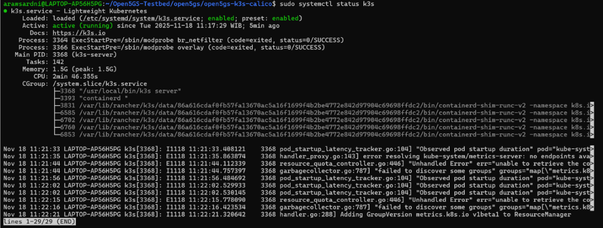

```bash
# Check nodes
kubectl get nodes
```

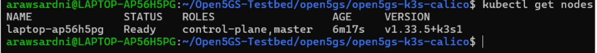

Expected output:

```
NAME     STATUS   ROLES           AGE   VERSION
<node>   Ready    control-plane   Xm    v1.2X.X
```

### Step 3: Build dan Import Container Images

```bash
# Make script executable
chmod +x build-import-containers.sh

# Build Open5GS images
sudo ./build-import-containers.sh
```

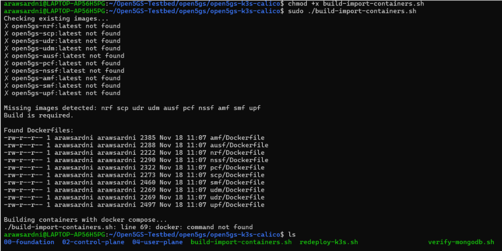

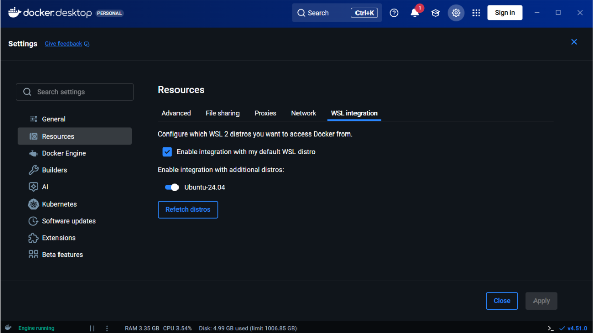

```bash
# Verifikasi images
sudo k3s crictl images
```

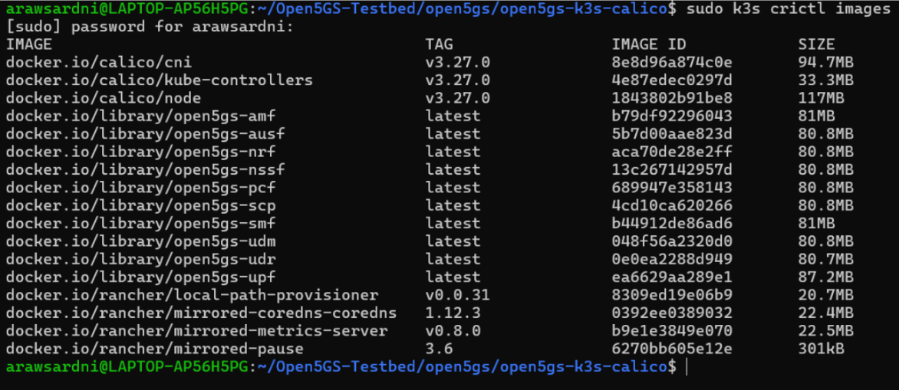

### Step 4: Deploy Open5GS ke K3s

```bash
# Make script executable
chmod +x deploy-k3s-calico.sh

# Deploy
sudo ./deploy-k3s-calico.sh
```

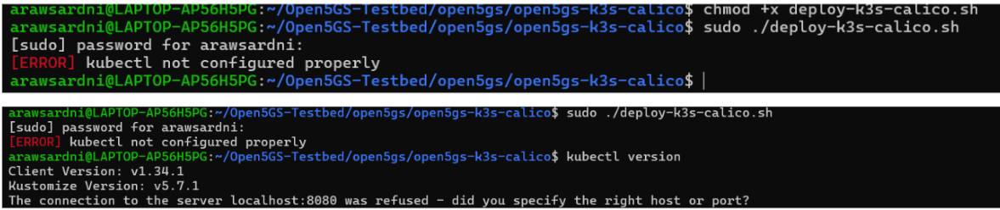

**🔥 Penyebab utama error:**

Saat menjalankan `sudo ./deploy-k3s-calico.sh`, sudo akan menjalankan script sebagai root user, dan root mencari kubeconfig di `/root/.kube/config`, padahal kubeconfig ada di `/home/arawsardni/.kube/config`. Jadi `kubectl get nodes` gagal di dalam script karena root tidak punya konfigurasi kubectl.

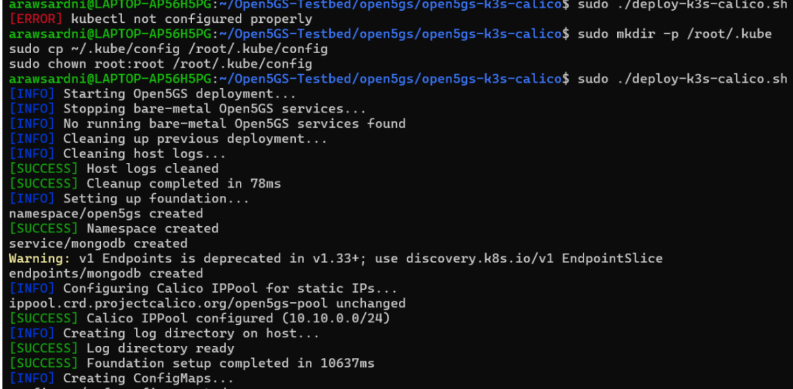

```bash
# Monitor deployment (di terminal baru)
kubectl get pods -n open5gs -w
```

Deployment akan:

- ✅ Create namespace open5gs
- ✅ Setup Calico IPPool
- ✅ Create MongoDB service
- ✅ Deploy NF dalam order yang benar (dependency management)
- ✅ Generate deployment report

Tunggu hingga semua pod running (~2-3 menit):

```bash
# Check all pods
kubectl get pods -n open5gs
```

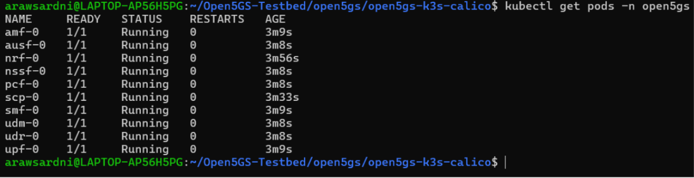

Expected output (all should be Running):

```
NAME      READY   STATUS    RESTARTS   AGE
nrf-0     1/1     Running   0          2m
scp-0     1/1     Running   0          2m
udr-0     1/1     Running   0          2m
udm-0     1/1     Running   0          2m
ausf-0    1/1     Running   0          2m
pcf-0     1/1     Running   0          2m
nssf-0    1/1     Running   0          2m
amf-0     1/1     Running   0          2m
smf-0     1/1     Running   0          2m
upf-0     1/1     Running   0          2m
```

---

## Verifikasi Deployment

### 1. Cek Status Semua NF

```bash
# List semua pods dengan detail
kubectl get pods -n open5gs -o wide
```

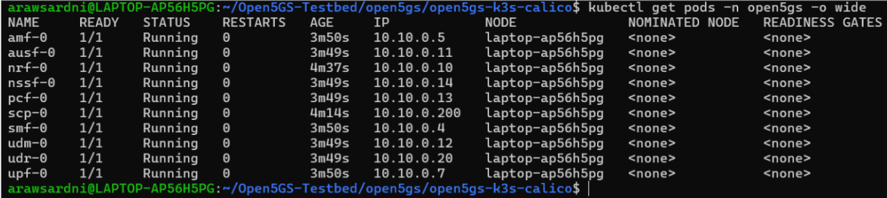

```bash
# Check logs untuk NF tertentu
kubectl logs -n open5gs amf-0
```

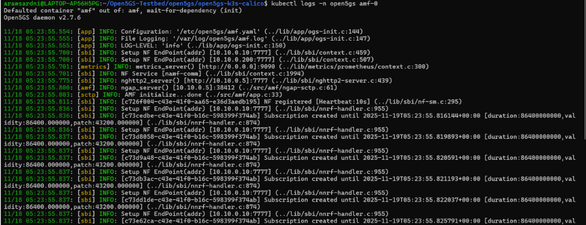

```bash
kubectl logs -n open5gs smf-0
```

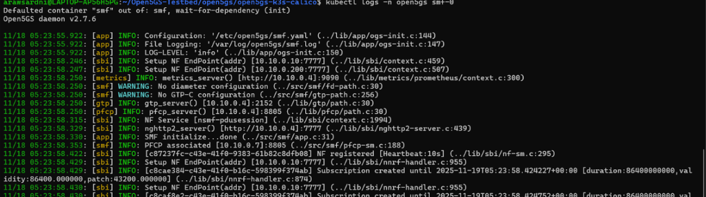

```bash
kubectl logs -n open5gs upf-0
```

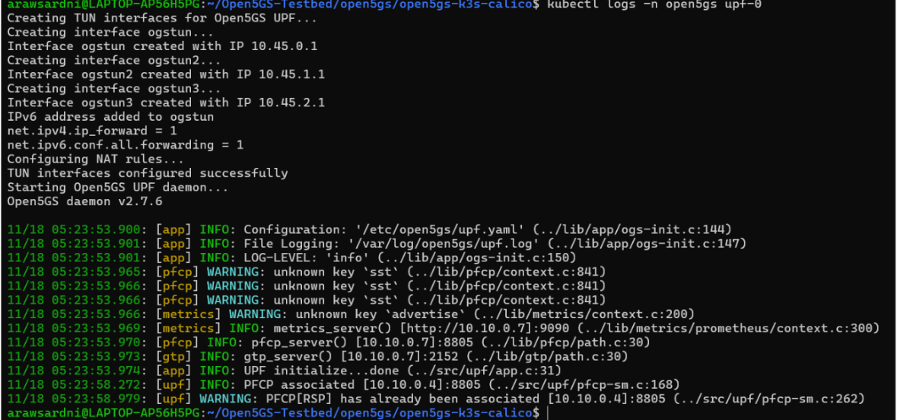

### 2. Verifikasi Static IP Assignment

```bash
# Run verification script
sudo ./verify-static-ips.sh
```

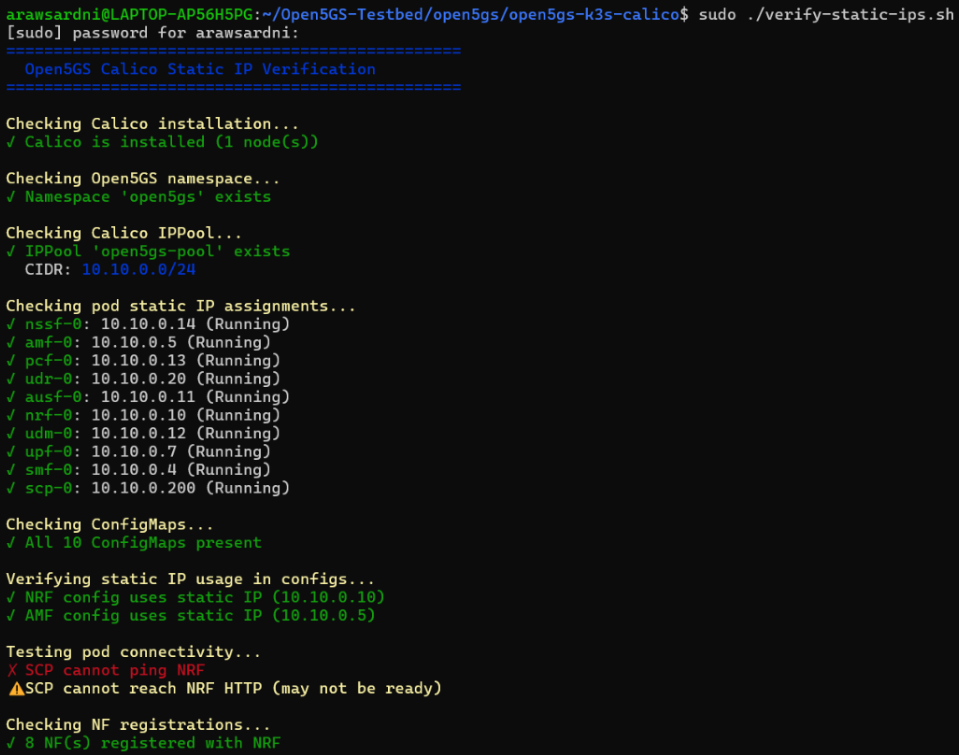

Expected output:

```
✓ nrf-0: 10.10.0.10
✓ scp-0: 10.10.0.200
✓ amf-0: 10.10.0.5
✓ smf-0: 10.10.0.4
✓ upf-0: 10.10.0.7
... (semua NF)
```

### 3. Verifikasi MongoDB Connectivity

```bash
# Run MongoDB verification
sudo ./verify-mongodb.sh
```

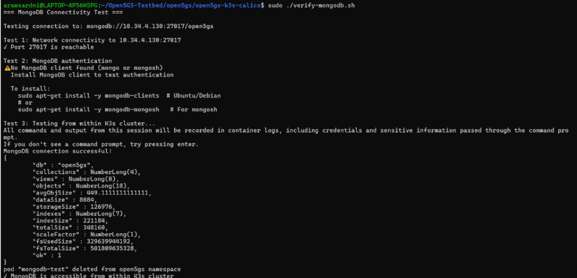

Expected output:

```
MongoDB: CONNECTED
Database: open5gs
Collection count: X subscribers
```

### 4. Cek Service Connectivity

```bash
# Test NF connectivity from K3s pod
kubectl exec -it -n open5gs nrf-0 -- \
  /bin/sh -c "curl -s http://amf-0.amf.open5gs.svc.cluster.local:7777/nnrf-nfm/v1/nf-instances"

# Atau gunakan pod shell
kubectl exec -it -n open5gs amf-0 -- /bin/bash

# Di dalam pod:
$ curl -s http://nrf-0.nrf.open5gs.svc.cluster.local:7777/nnrf-nfm/v1/nf-instances
```

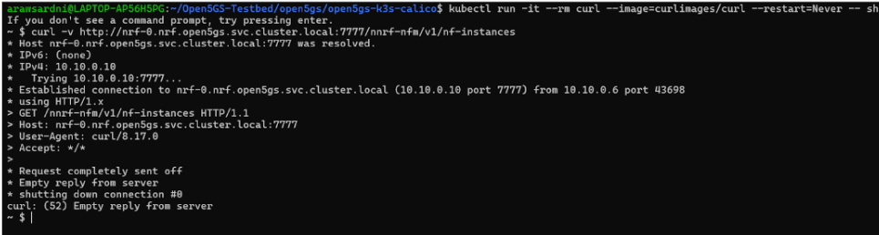

---

## Tugas 1: Konektivitas Dasar

### Objective

Verify bahwa Open5GS deployment berfungsi dengan benar dan dapat connect dengan UERANSIM.

### Prerequisites

- K3s deployment selesai
- Semua pods running
- UERANSIM binary tersedia

### Langkah-Langkah

#### 1.1 Persiapkan UERANSIM pada host eksternal

```bash
# Di mesin yang berbeda dari K3s (atau terminal baru dengan user biasa):
cd ~/Open5GS-Testbed/ueransim

# Modifikasi gNB config untuk connect ke K3s AMF
# Ubah AMF address di open5gs-gnb-k3s.yaml:
# amfConfigs:
#   - address: <IP address dari K3s cluster>
#     port: 38412
```

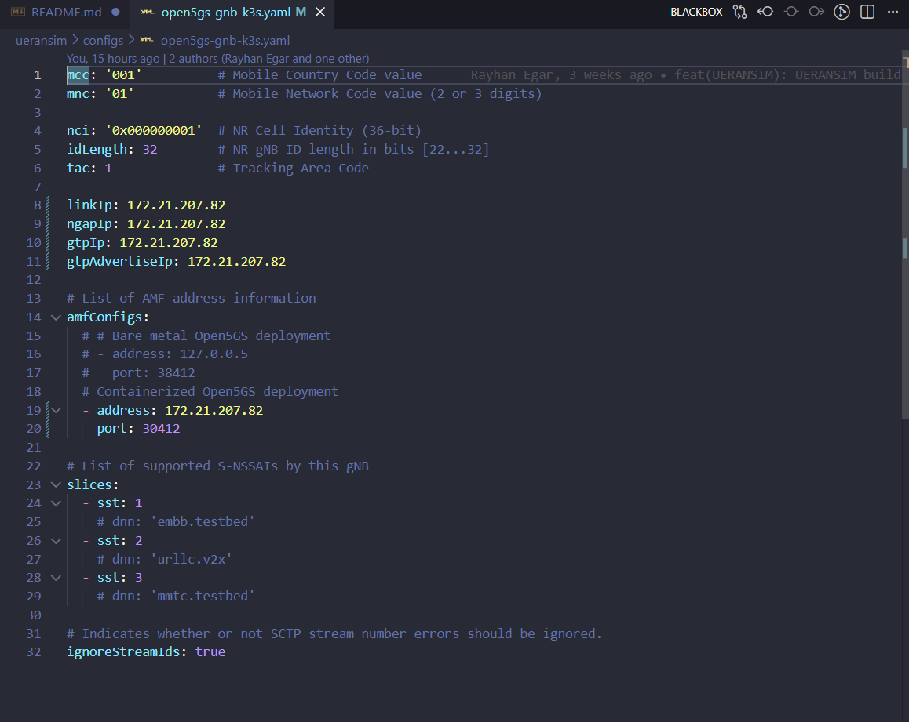

#### 1.2 Start gNB Simulator

```bash
# Terminal 1 - gNB
cd ~/Open5GS-Testbed/ueransim
./build/nr-gnb -c configs/open5gs-gnb-k3s.yaml
```

Expected output:

```
[sctp] [info] Trying to establish SCTP connection... (10.X.X.X:38412)
[sctp] [info] SCTP connection established
[ngap] [info] NG Setup procedure is successful
```

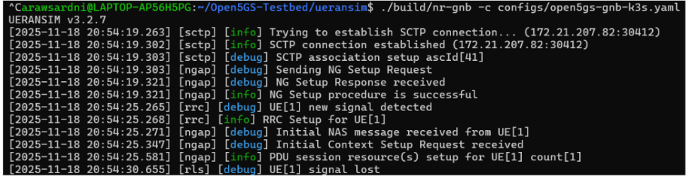

#### 1.3 Start UE Simulator

```bash
# Terminal 2 - UE
cd ~/Open5GS-Testbed/ueransim
sudo ./build/nr-ue -c configs/open5gs-ue-embb.yaml
```

Expected output:

```
[nas] [info] UE switches to state [MM-REGISTERED/NORMAL-SERVICE]
[nas] [info] PDU Session establishment is successful PSI[1]
[app] [info] Connection setup for PDU session[1] is successful, TUN interface[uesimtun0, 10.45.0.X] is up.
```

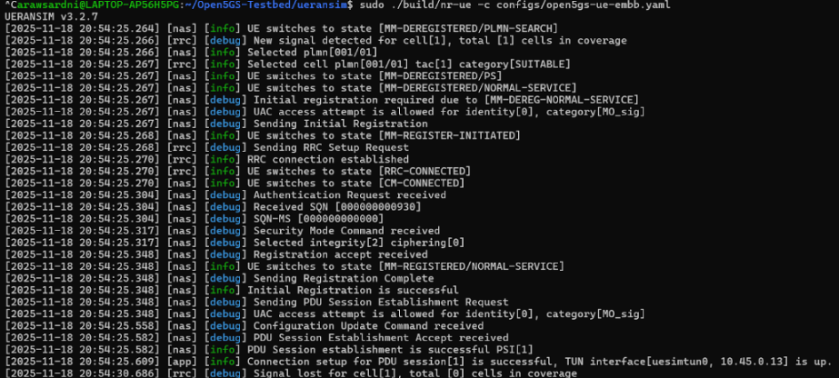

#### 1.4 Test Basic Connectivity

```bash
# Terminal 3 - Testing

# Test UE TUN interface
ip addr show uesimtun0
```

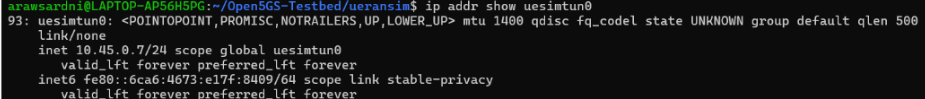

```bash
# Test gateway connectivity (UE -> UPF)
ping -I uesimtun0 -c 4 10.45.0.1
```

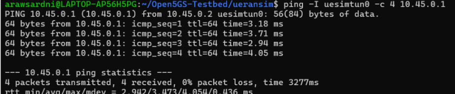

```bash
# Test internet connectivity
ping -I uesimtun0 -c 4 8.8.8.8
```

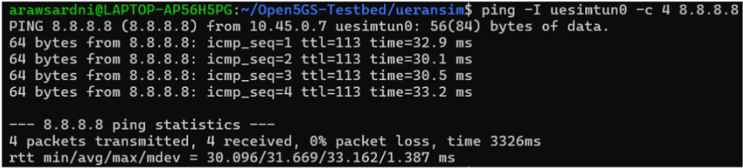

```bash
# Test DNS resolution
nslookup google.com 8.8.8.8
```

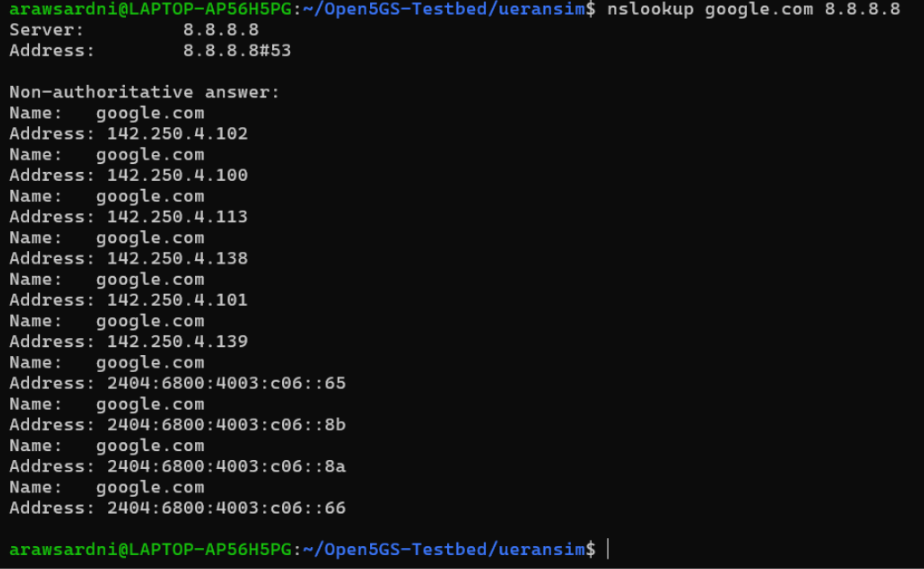

```bash
# Test HTTP/HTTPS
curl --interface uesimtun0 -I https://www.google.com
```

### 1.5 Dokumentasi Hasil

## Tugas 1: Konektivitas Dasar

**Tanggal**: 18 November 2025  
**Nama**: Gaung Taqwa Indraswara  
**Status K3s**: WORKING

### gNB Registration

- Status: SUCCESS
- Time taken: ~10 ms (Estimasi dari log: Setup Request vs Setup Response)
- AMF Connection: ESTABLISHED

### UE Registration

- Status: SUCCESS
- Time taken: ~285 ms (Estimasi dari log: Initial Registration vs TUN Interface Up)
- IMSI: 001011000000001
- TUN Interface: uesimtun0
- IP Address: 10.45.0.6

### Connectivity Tests

| Test                    | Result | RTT (ms)  |
| ----------------------- | ------ | --------- |
| UPF Gateway (10.45.0.1) | ✓ PASS | 2.942 ms  |
| Internet (8.8.8.8)      | ✓ PASS | 30.096 ms |
| DNS Resolution          | ✓ PASS | -         |
| HTTP/HTTPS              | ✓ PASS | -         |

### Issues Encountered

- **Authentication Failure (SQN Sync)**: UE ditolak dengan error auth karena Sequence Number (SQN) di database lebih rendah/tidak sinkron dengan UE.
- **Network Slice Mismatch**: Terjadi error Cannot find Requested NSSAI. Konfigurasi AMF hanya mendukung SST 1 (tanpa SD), sedangkan UE/DB dikonfigurasi dengan SST 1 + SD 000001.
- **Data Plane Failure (Bad Checksum)**: Ping ke gateway 10.45.0.1 gagal (full packet loss) meskipun tunnel terbentuk, disebabkan oleh Checksum Offloading pada interface virtual WSL.
- **Routing & NAT**: Akses internet gagal karena host tidak mem-forward paket dari subnet privat UE (10.45.0.0/16) ke internet.
- **Stuck Pods**: Pod UPF macet di status ContainerCreating setelah melakukan flush iptables.

### Resolution

- **Database Reset**: Melakukan clean reset pada MongoDB dengan memasukkan data subscriber yang memiliki SQN tinggi dan format Slice yang benar (menghapus field sd).
- **Config Adjustment**: Menyesuaikan open5gs-ue-embb.yaml dengan menghapus parameter sd agar sesuai dengan kemampuan AMF default.
- **Network Optimization**: Menonaktifkan checksum offloading menggunakan perintah `sudo ethtool -K eth0 tx off rx off`.
- **IP Tables & NAT**: Mengaktifkan IP Forwarding dan menambahkan aturan NAT Masquerade (`iptables -t nat -A POSTROUTING -o eth0 -j MASQUERADE`) serta mengizinkan FORWARD ACCEPT.
- **Service Recovery**: Melakukan restart service K3s (`sudo systemctl restart k3s`) dan menghapus paksa pod yang macet (force delete) untuk memulihkan CNI plugin.
